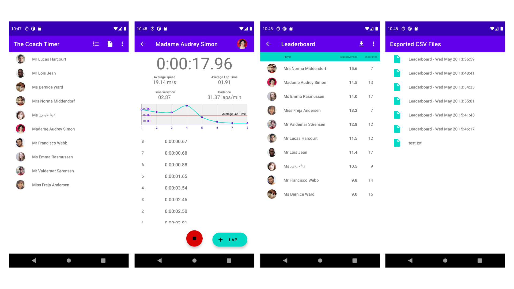

Coach timer app
=====================
Simple Coach timer demonstration, for managing running sessions.

Installation
=====

1. Clone this repo
2. Open project in AndroidStudio, make sure you have the latest version installed.
3. Let Android studio build the project.
4. Then run either the app, UnitTests or AndroidUnitTests

Libraries used
=====

Except for some basic android and kotlin libraries for Material Design, Coroutines and similar, I have used

1. [MPAndroidCharts](https://github.com/PhilJay/MPAndroidChart) for Showing the simple chart in the SessionActivity. This library is a bit overkill for this simple use case. But its up to date and does the job well.
2. [GSON](https://github.com/google/gson) for serialize and deserialize json
3. [Glide](https://github.com/bumptech/glide) makes it very simple to download and cache images and then to display them in an imageview
4. [Okhttp](https://square.github.io/okhttp/) for networking, this app only uses one get request and one post. For a larger project with a bigger api I would consider retrofit.

Notes
=====

- UnitTests for the coroutines in the ViewModels took too long to setup so for this exercise I skipped it, but with more time its something I would absolutely add.
- The leaderboard loading the list of user with some randomly generated data. With more time this should obviously be loaded from the database. The leaderboard should also show the sorting a bit more obviously than just the sorted value being bold.
- As the app is suppose to work offline the list of players is stored in the raw folder and is loaded on app start. There is also a function to load the players with a get request to the api, accessible in the overflow menu in the MainActivity.
- All lap times for a session are stored in a local db where the array of lap times is converted to a ByteArray before being stored and converted back when retrieved from the database.
- Both the syncing of data to server and the generation of csv files are done in JobIntentServices to let the user continue using the ui. The Server sync shows a toast when it starts and when its done when leaving the SessionActivity, while the CSV generation is shown with a notification while its going and when its done.
- For this test I used on RecyclerAdapter and some different viewholder bindings as the lists in this app are very similar. For a bigger project it might not be ideal.

Screenshots
===========

